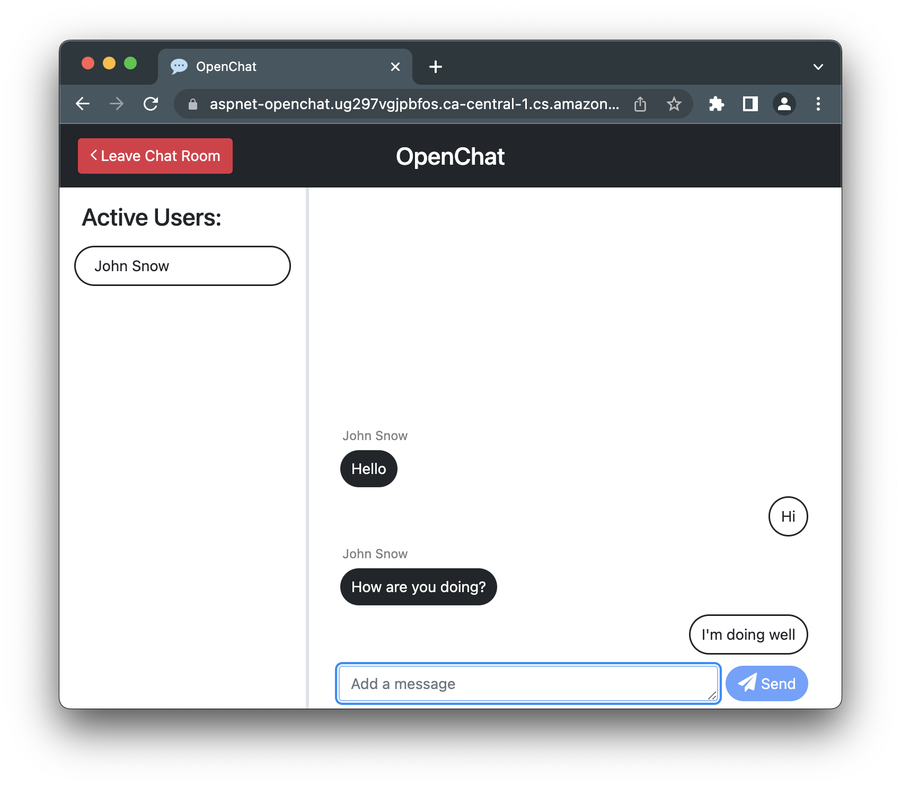

# OpenChat

  
Table of Contents

  <ol>
    <li>
      <a href="#about-the-project">About The Project</a>
      <ul>
        <li><a href="#built-with">Built With</a></li>
      </ul>
      <ul>
        <li><a href="#hosted-on">Hosted on</a></li>
      </ul>
    </li>
    <li><a href="#usage">Usage</a></li>
    <li><a href="#next-steps">Next Steps</a></li>
    <li><a href="#useful-resources">Useful Resources</a></li>
  </ol>

## About The Project

OpenChat is a web application built with ASP.NET that allows users to chat in a single open chat room without having to create an account. It uses the SignalR library to establish a connection between a client (the users browser) and the server. This allows the server to receive messages from a client and broadcast them to all other connected clients. 

### Built With

* 
* 

### Hosted on
* 

## Usage

A Docker image of the OpenChat web application is currently running on a container in AWS Lightsail. The web application can be used by opening the following link: :sparkles: **[Try OpenChat](https://aspnet-openchat.ug297vgjpbfos.ca-central-1.cs.amazonlightsail.com/)** :sparkles:

## Next Steps

- Store messages to a PostgreSQL database running on AWS RDS

## Useful Resources

* [Bootstrap Docs](https://getbootstrap.com/docs/5.3/getting-started/introduction/)
* [SignalR Docs](https://learn.microsoft.com/en-ca/aspnet/core/signalr/introduction?WT.mc_id=dotnet-35129-website&view=aspnetcore-7.0)
* [Hosting ASP.NET app using AWS Lightsail](https://aws.amazon.com/blogs/compute/frictionless-hosting-of-containerized-asp-net-web-apps-using-amazon-lightsail/)
